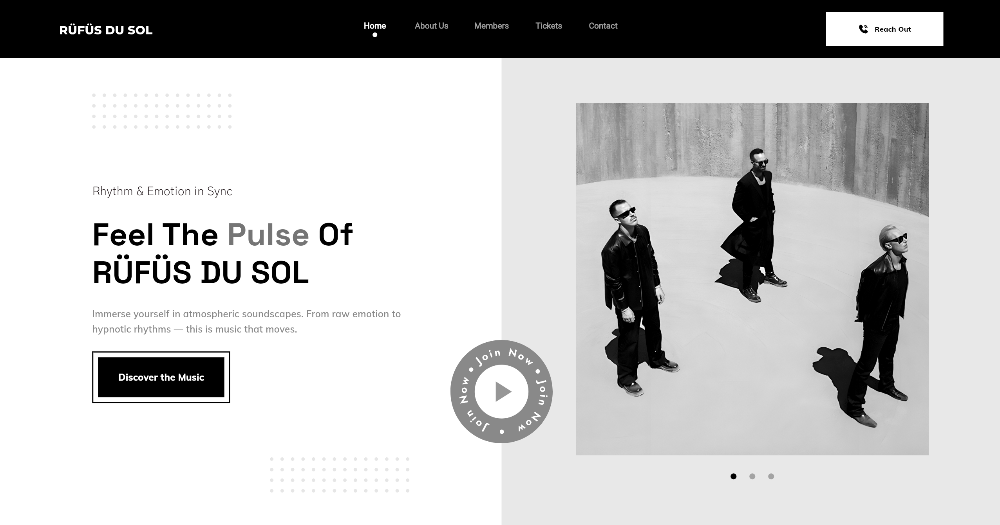
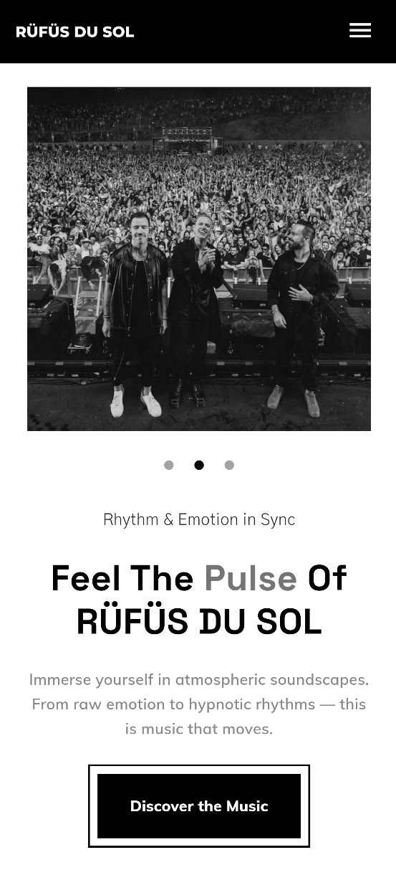

# RÜFÜS DU SOL — Music Band Landing Page

A responsive single-page music website originally built with HTML, CSS and
JavaScript, then reimplemented in Flutter Web. It is my first Flutter Web
project, created as part of my portfolio.

<p align="center">
  <strong>
    → <a href="https://xfusek.github.io/rufusdusol-website/">View Live Demo</a> ←
  </strong>
</p>

## Preview

<table>
  <tr>
    <td align="center" width="70%">
      
      <br>
      <sub><b>Desktop</b></sub>
    </td>
    <td align="center" width="30%">
      
      <br>
      <sub><b>Mobile</b></sub>
    </td>
  </tr>
</table>

## Features

- Responsive layout for desktop, tablet, and mobile screens
- Automatic hero carousel with navigation dots and swipe gestures
- Smooth in-page navigation
- Interactive music badge synchronized with an embedded YouTube player

## Technical Overview

Built with Flutter Web and Dart, using `flutter_svg` for vector assets,
`youtube_player_iframe` for music playback, and `url_launcher` for external
links. The website is deployed with GitHub Pages.

Concert information is stored locally as strongly typed Dart data, keeping the
current project scope backend-free while leaving room for future API integration.

## Project Structure

```text
lib/
├── app.dart
├── main.dart
└── landing/
    ├── landing_page.dart
    ├── shared/
    │   ├── background_music.dart
    │   ├── landing_header.dart
    │   └── section_divider.dart
    └── sections/
        ├── about/
        ├── contact/
        ├── hero/
        ├── members/
        └── tickets/
```

The project follows a feature-based structure. Each section contains its own
layout and supporting widgets, while reusable components are kept in
`landing/shared`.

## Design and Credits

- The visual concept was adapted to Flutter Web in consultation with
  [**Evelina**](https://www.linkedin.com/in/evelina-bolshakova/)
  [](https://www.behance.net/evelinabolshakova/)
- The loading screen uses the
  [Recording animation](https://lottiefiles.com/free-animation/recording-m24o2hRFNp)
  from LottieFiles under the Lottie Simple License.

## Disclaimer

This is a non-commercial educational and portfolio project. It is not
affiliated with, endorsed by, or officially connected to RÜFÜS DU SOL. Artist
names, music, images and trademarks belong to their respective owners.
